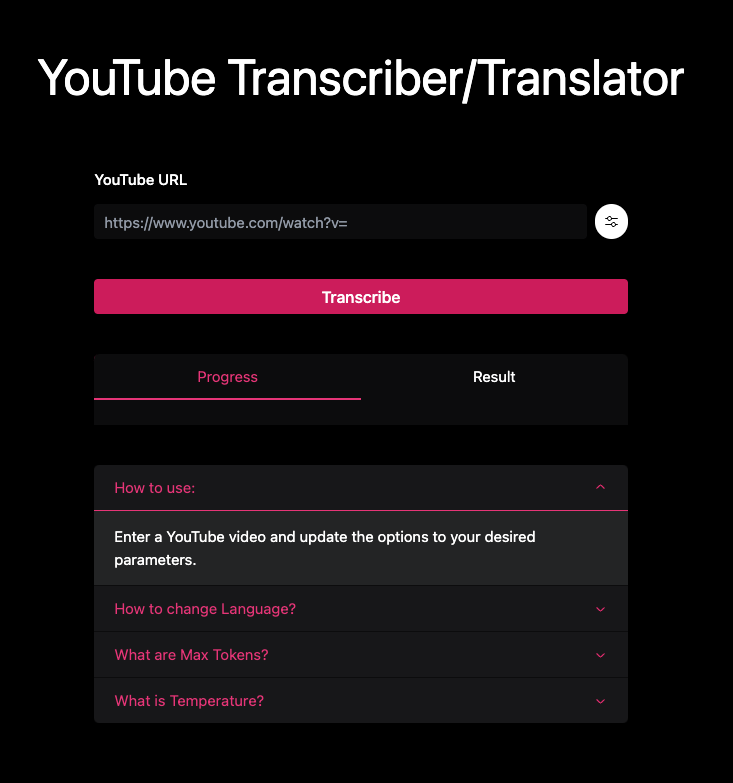

## Getting Started



## How to use

1. Get your OpenAI API Key [here](https://platform.openai.com/account/api-keys)
2. Set an environment variable `$OPENAI_API_KEY`
3. Run the following commands

```bash
pip install -r requirements.txt
npm i
npm run dev
```
